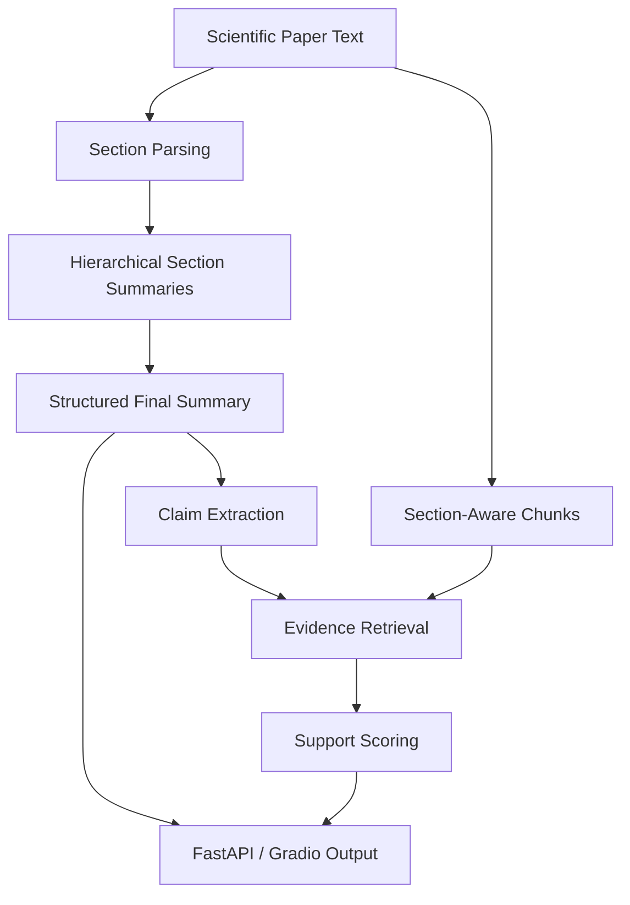

# SciSum-Qwen

[](https://mokarami-scisum-qwen.hf.space)
[](https://huggingface.co/spaces/mokarami/scisum-qwen)
[](models/qwen-arxiv-qlora-colab/adapter_model.safetensors)

Faithful long-document scientific paper summarization with `Qwen2.5-3B-Instruct`, `QLoRA`, hierarchical section-aware inference, and claim-level evidence support scoring.

## Live Demo

- Public app: [mokarami-scisum-qwen.hf.space](https://mokarami-scisum-qwen.hf.space)
- Public Space repo: [huggingface.co/spaces/mokarami/scisum-qwen](https://huggingface.co/spaces/mokarami/scisum-qwen)
- Public deployment validation: [reports/public_space_validation.md](reports/public_space_validation.md)

## What This Project Does

You give the system a long scientific paper. It:

1. parses section-aware paper structure
2. handles long inputs with hierarchical summarization
3. generates a structured scientific summary
4. retrieves evidence for summary claims
5. scores how well claims are supported by the source text
6. serves the workflow through a FastAPI layer, a polished Gradio demo, and a public Hugging Face Space

## Why It Is Stronger Than A Simple Summarizer

- It is not only a prompt wrapper around a hosted model.
- It includes a real `QLoRA`-adapted scientific summarization model.
- It handles long-document structure instead of naive truncation.
- It exposes claim-level evidence support instead of only returning text.
- It includes tracked evaluation artifacts, a shipped adapter, and a deployed public demo.

## System Overview



## What Has Been Validated

### Real Model-Backed Local API

The adapter-backed local service was smoke-tested successfully:

- `GET /health` returned `200`
- `GET /model-info` returned `200`
- `POST /summarize` returned `200`
- `POST /evidence-support` returned `200`
- the local summary backend reported `qwen-backed generation`

Relevant code:

- [`src/scisum_qwen/api/service.py`](src/scisum_qwen/api/service.py)
- [`src/scisum_qwen/inference/generator.py`](src/scisum_qwen/inference/generator.py)
- [`scripts/smoke_test_api.py`](scripts/smoke_test_api.py)

### Public Demo Validation

The public Hugging Face Space was tested end-to-end after deployment:

- public app returned `HTTP 200`
- public Gradio API exposed `/run_demo`
- end-to-end prediction completed successfully
- validation details are recorded in [reports/public_space_validation.md](reports/public_space_validation.md)

The public Space runs on constrained `cpu-basic` hardware, so response latency and backend behavior can differ from local adapter-backed inference. The local API validation above is the stronger proof for the trained artifact path.

## Real Artifacts Included In This Repo

- Trained adapter:
  - [`models/qwen-arxiv-qlora-colab/adapter_config.json`](models/qwen-arxiv-qlora-colab/adapter_config.json)
  - [`models/qwen-arxiv-qlora-colab/adapter_model.safetensors`](models/qwen-arxiv-qlora-colab/adapter_model.safetensors)
  - [`models/qwen-arxiv-qlora-colab/README.md`](models/qwen-arxiv-qlora-colab/README.md)
- Colab run outputs:
  - [`reports/colab_runs/final_eval.md`](reports/colab_runs/final_eval.md)
  - [`reports/colab_runs/final_experiment_report.md`](reports/colab_runs/final_experiment_report.md)
  - [`reports/colab_runs/final_metrics.csv`](reports/colab_runs/final_metrics.csv)
  - [`reports/colab_runs/final_model_comparison.csv`](reports/colab_runs/final_model_comparison.csv)
  - [`reports/colab_runs/colab_training_log.md`](reports/colab_runs/colab_training_log.md)
- Public deployment proof:
  - [`reports/public_space_validation.md`](reports/public_space_validation.md)

## Featured Demo Input

A stronger paper-like demo sample is included here:

- [`data/samples/featured_demo_paper.txt`](data/samples/featured_demo_paper.txt)

## Project Structure

```text
scisum-qwen/
├── app/                    # polished Gradio UI
├── colab/                  # Colab notebook for heavy runs
├── configs/                # training / inference / eval configs
├── data/                   # sample inputs and processed subsets
├── models/                 # tracked QLoRA adapter artifacts
├── reports/                # evaluation, experiment, and validation outputs
├── scripts/                # deploy, smoke-test, packaging helpers
├── src/scisum_qwen/        # core package
└── tests/                  # unit and smoke-level tests
```

## Key Modules

- [`src/scisum_qwen/api/service.py`](src/scisum_qwen/api/service.py)
  - orchestration layer for summarization and evidence support
- [`src/scisum_qwen/inference/generator.py`](src/scisum_qwen/inference/generator.py)
  - model-backed inference with adapter loading
- [`src/scisum_qwen/inference/hierarchical.py`](src/scisum_qwen/inference/hierarchical.py)
  - section-aware hierarchical summarization logic
- [`src/scisum_qwen/evidence/support_scorer.py`](src/scisum_qwen/evidence/support_scorer.py)
  - claim-level evidence support scoring
- [`app/gradio_app.py`](app/gradio_app.py)
  - public demo application

## Local Setup

```bash
python -m venv .venv
source .venv/bin/activate
pip install -r requirements.txt
pip install -e .
pytest
```

Useful commands:

```bash
make baseline
make evaluate
make compare
make errors
make evidence
make api
make demo
make test-public-space
```

## Quick Demo Test

```bash
PYTHONPATH=src .venv/bin/python scripts/smoke_test_api.py
```

Public demo check:

```bash
.venv/bin/python scripts/test_public_space.py
```

## Deployment

Public deployment target used for this project:

- Hugging Face Spaces with `Gradio`

Deploy script:

```bash
HF_TOKEN=... .venv/bin/python scripts/deploy_hf_space.py --repo-id mokarami/scisum-qwen
```

Alternative product path:

- `FastAPI` + Docker via [`Dockerfile`](Dockerfile) and [`render.yaml`](render.yaml)

## Limitations

- The tracked experiment metrics come from a reduced subset run, not a full-scale final benchmark.
- Claim support scoring estimates grounding but does not formally prove factual correctness.
- Public Space inference on `cpu-basic` is slower and less representative than local hardware-backed model execution.

## Resume-Ready Summary

Built a faithful long-document scientific paper summarization system using `Qwen2.5-3B-Instruct` and `QLoRA`, combining section-aware hierarchical inference, claim-level evidence retrieval, tracked evaluation artifacts, a shipped trained adapter, a FastAPI backend, and a publicly deployed Hugging Face Space demo.
